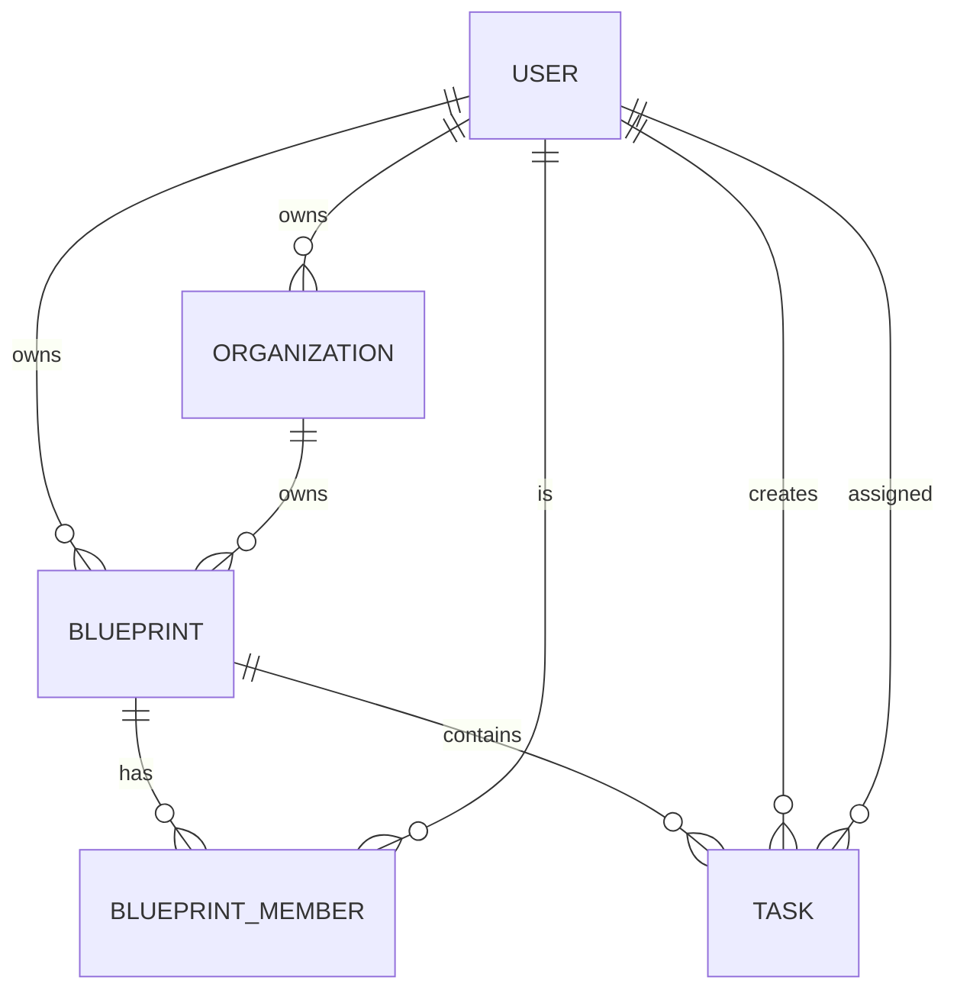

# 資料模型 (Data Model)

> 本目錄包含 GigHub 專案的 Firestore 資料庫結構、集合定義與資料關聯設計文件。

## 📋 目錄結構

```
data-model/
├── README.md                       # 本檔案
├── 01-data-model-overview.md      # 資料模型總覽
├── 02-firestore-collections.md    # Firestore 集合結構
├── 03-indexes.md                  # 索引設計
├── 04-relationships.md            # 資料關聯
├── 05-schema-evolution.md         # Schema 演進策略
├── 06-contract-data-model.md      # 合約資料模型摘要（docs-old 提取）
├── schemas/                       # Collection Schema
│   ├── blueprint.schema.md
│   ├── blueprint-member.schema.md
│   ├── task.schema.md
│   ├── user.schema.md
│   └── organization.schema.md
└── diagrams/                      # ER 圖與關聯圖
    └── entity-relationship.mermaid
```

## 🎯 核心集合 (Core Collections)

### 1. users (使用者)

```typescript
interface User {
  id: string;                    // Document ID
  email: string;
  displayName: string;
  photoURL?: string;
  role: 'admin' | 'user';
  createdAt: Timestamp;
  updatedAt: Timestamp;
  deletedAt: Timestamp | null;
}
```

**索引**:
- `email` (單一欄位索引)
- `createdAt` (單一欄位索引)

### 2. organizations (組織)

```typescript
interface Organization {
  id: string;
  name: string;
  ownerId: string;              // User ID
  description?: string;
  createdAt: Timestamp;
  updatedAt: Timestamp;
  deletedAt: Timestamp | null;
}
```

**索引**:
- `ownerId` (單一欄位索引)

### 3. blueprints (藍圖)

```typescript
interface Blueprint {
  id: string;
  name: string;
  ownerType: 'user' | 'organization';
  ownerId: string;              // User ID or Organization ID
  description?: string;
  metadata?: Record<string, any>;
  createdAt: Timestamp;
  updatedAt: Timestamp;
  deletedAt: Timestamp | null;
}
```

**索引**:
- `ownerId` (單一欄位索引)
- `ownerType, ownerId` (複合索引)

### 4. blueprintMembers (藍圖成員)

**Document ID 格式**: `{userId}_{blueprintId}`

```typescript
interface BlueprintMember {
  id: string;                   // userId_blueprintId
  blueprintId: string;
  userId: string;
  memberType: 'user' | 'team' | 'partner';
  memberId: string;             // user/team/partner ID
  role: 'owner' | 'admin' | 'member' | 'viewer';
  permissions: string[];        // ['task:create', 'task:update']
  status: 'active' | 'suspended' | 'revoked';
  invitedBy?: string;           // User ID
  invitedAt?: Timestamp;
  joinedAt: Timestamp;
  createdAt: Timestamp;
  updatedAt: Timestamp;
}
```

**索引**:
- `blueprintId` (單一欄位索引)
- `userId` (單一欄位索引)
- `blueprintId, status` (複合索引)
- `userId, status` (複合索引)

### 5. tasks (任務)

```typescript
interface Task {
  id: string;
  blueprintId: string;
  title: string;
  description: string;
  status: 'pending' | 'in-progress' | 'completed' | 'archived';
  priority?: 'low' | 'medium' | 'high' | 'urgent';
  assignedTo?: string;          // user/team/partner ID
  assignedToType?: 'user' | 'team' | 'partner';
  executor?: string;            // Actual user performing the task
  accountable: string;          // User or organization responsible
  dueDate?: Timestamp;
  tags?: string[];
  metadata?: Record<string, any>;
  createdBy: string;            // User ID
  createdAt: Timestamp;
  updatedAt: Timestamp;
  deletedAt: Timestamp | null;
}
```

**索引**:
- `blueprintId` (單一欄位索引)
- `assignedTo` (單一欄位索引)
- `status` (單一欄位索引)
- `blueprintId, status` (複合索引)
- `blueprintId, assignedTo` (複合索引)
- `blueprintId, deletedAt, createdAt` (複合索引)

### 6. auditLogs (審計日誌)

```typescript
interface AuditLog {
  id: string;
  userId: string;               // Who performed the action
  actingAs?: {                  // If acting on behalf of team/org
    type: 'team' | 'partner' | 'organization';
    id: string;
  };
  blueprintId?: string;         // Related blueprint (if any)
  action: string;               // 'task.created', 'member.added', etc.
  resourceType: string;         // 'task', 'blueprint', 'member'
  resourceId: string;
  changes?: {                   // What changed
    before?: any;
    after?: any;
  };
  metadata?: Record<string, any>;
  timestamp: Timestamp;
  ipAddress?: string;
  userAgent?: string;
}
```

**索引**:
- `userId` (單一欄位索引)
- `blueprintId` (單一欄位索引)
- `resourceType, resourceId` (複合索引)
- `timestamp` (單一欄位索引，降序)

## 🔗 資料關聯設計

### 關聯類型



### 查詢模式

#### 1. 查詢使用者的所有藍圖

```typescript
// 透過 blueprintMembers 查詢
const memberDocs = await getDocs(
  query(
    collection(firestore, 'blueprintMembers'),
    where('userId', '==', currentUserId),
    where('status', '==', 'active')
  )
);

const blueprintIds = memberDocs.docs.map(doc => doc.data().blueprintId);
```

#### 2. 查詢藍圖的所有任務

```typescript
// 直接查詢 tasks collection
const tasks = await getDocs(
  query(
    collection(firestore, 'tasks'),
    where('blueprintId', '==', blueprintId),
    where('deletedAt', '==', null),
    orderBy('createdAt', 'desc')
  )
);
```

#### 3. 檢查使用者是否為藍圖成員

```typescript
// 使用組合 ID 直接查詢
const memberId = `${userId}_${blueprintId}`;
const memberDoc = await getDoc(
  doc(firestore, 'blueprintMembers', memberId)
);

const isMember = memberDoc.exists() && 
                 memberDoc.data().status === 'active';
```

## 📊 索引優化策略

### 複合索引設計原則

1. **高選擇性欄位優先**: 將能過濾最多資料的欄位放前面
2. **等值查詢優先於範圍查詢**: `where` 條件在 `orderBy` 之前
3. **避免過度索引**: 每個索引都有寫入成本

### 範例：任務查詢索引

```
Collection: tasks
Indexes:
  - blueprintId ASC, deletedAt ASC, status ASC, createdAt DESC
  - blueprintId ASC, assignedTo ASC, status ASC
  - blueprintId ASC, dueDate ASC
```

## 🔄 Schema 演進策略

### 版本化欄位

```typescript
interface Task {
  // 舊版本
  assignee?: string;            // 已廢棄，保留相容性
  
  // 新版本
  assignedTo?: string;
  assignedToType?: 'user' | 'team' | 'partner';
  
  schemaVersion: number;        // 追蹤 schema 版本
}
```

### 遷移策略

1. **雙寫期**: 同時寫入新舊欄位
2. **遷移期**: 背景任務遷移舊資料
3. **雙讀期**: 優先讀取新欄位，回退舊欄位
4. **棄用期**: 移除舊欄位讀取邏輯
5. **清理期**: 刪除舊欄位

### 破壞性變更處理

```typescript
// 使用 Cloud Function 進行批次遷移
export const migrateTaskSchema = functions.pubsub
  .schedule('every 24 hours')
  .onRun(async () => {
    const batch = firestore.batch();
    const oldTasks = await getDocs(
      query(
        collection(firestore, 'tasks'),
        where('schemaVersion', '<', CURRENT_VERSION),
        limit(500)
      )
    );
    
    oldTasks.docs.forEach(doc => {
      const data = doc.data();
      batch.update(doc.ref, {
        assignedTo: data.assignee,
        assignedToType: 'user',
        schemaVersion: CURRENT_VERSION
      });
    });
    
    await batch.commit();
  });
```

## 💾 資料儲存最佳實踐

### 1. 軟刪除 (Soft Delete)

```typescript
// 不要硬刪除，使用 deletedAt
await updateDoc(doc(firestore, 'tasks', taskId), {
  deletedAt: Timestamp.now()
});

// 查詢時過濾已刪除項目
where('deletedAt', '==', null)
```

### 2. 時間戳記標準化

```typescript
// 統一使用 Firestore Timestamp
import { Timestamp } from '@angular/fire/firestore';

createdAt: Timestamp.now();
updatedAt: Timestamp.now();
```

### 3. 欄位命名規範

- 使用 `snake_case` (Firestore 欄位)
- TypeScript 介面使用 `camelCase`
- Repository 負責轉換

```typescript
// Firestore document
{
  blueprint_id: "blueprint-1",
  created_at: Timestamp
}

// TypeScript interface
interface Task {
  blueprintId: string;
  createdAt: Date;
}
```

### 4. 文件大小限制

- Firestore 單一文件限制：1 MB
- 避免在文件中儲存大型陣列
- 考慮使用子集合

## 📚 相關文件

- [架構設計](../architecture(架構)/README.md) - 系統架構與設計模式
- [API 規格](../api(API/介面規格)/README.md) - API 介面定義
- [安全規範](../security(安全)/README.md) - Security Rules 設計

## 🔄 變更記錄

### v1.0.0 (2025-12-21)
- ✅ 建立核心集合 Schema
- ✅ 定義索引策略
- ✅ 說明資料關聯設計
- ✅ 制定 Schema 演進策略

---

**維護者**: GigHub 開發團隊  
**最後更新**: 2025-12-21  
**版本**: v1.0.0
