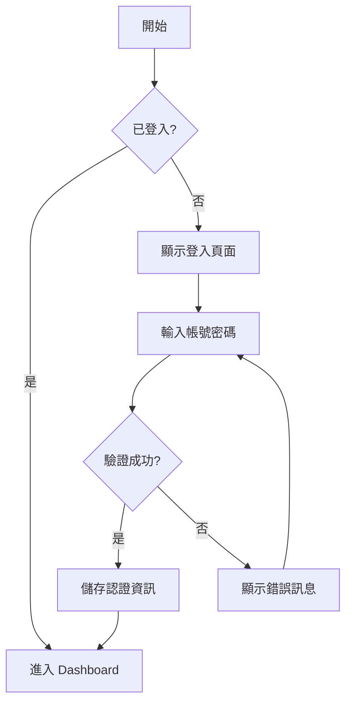
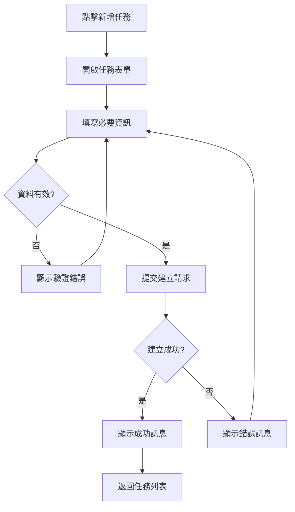

# 設計 (Design)

> 本目錄包含 GigHub 專案的 UI/UX 設計指南、介面流程、元件設計原則與可存取性規範。

## 📋 目錄結構

```
design/
├── README.md                    # 本檔案
├── 01-design-overview.md       # 設計總覽
├── 02-ui-flow.md               # 介面流程設計
├── 03-component-design.md      # 元件設計原則
├── 04-accessibility.md         # 可存取性指南
├── 05-responsive-design.md     # 響應式設計
└── 06-blueprint-ownership-membership.md # Blueprint 所有權/成員設計（docs-old 提取）
├── mockups/                    # UI 設計稿
│   ├── dashboard.png
│   ├── blueprint-list.png
│   └── task-detail.png
└── flows/                      # 使用者流程圖
    ├── login-flow.mermaid
    └── task-creation-flow.mermaid
```

## 🎨 設計原則

### 1. 玄武主題特色

GigHub 採用玄武主題，象徵**穩定、專業、智慧、守護**：

**核心色彩**:
- **主色 (Primary)**: `#1E3A8A` - 玄武深藍
- **成功 (Success)**: `#0D9488` - 深青綠
- **警告 (Warning)**: `#F59E0B` - 琥珀黃
- **錯誤 (Error)**: `#EF4444` - 赤紅
- **資訊 (Info)**: `#64748B` - 鋼藍

**設計特徵**:
- 深沉穩重的色調
- 適度留白與內斂呈現
- 精緻的陰影系統
- 流暢的過渡動畫

參考：[ui-theme(主題)/README.md](../ui-theme(主題)/README.md)

### 2. 視覺層次

```
┌─────────────────────────────────┐
│  Primary Action (主要操作)       │  明顯、突出
├─────────────────────────────────┤
│  Secondary Actions (次要操作)    │  清晰但不搶眼
├─────────────────────────────────┤
│  Content (內容)                  │  易讀、舒適
├─────────────────────────────────┤
│  Metadata (元資訊)               │  低調、輔助
└─────────────────────────────────┘
```

### 3. 一致性原則

- **視覺一致性**: 統一的色彩、字體、間距
- **互動一致性**: 相同元件的行為一致
- **結構一致性**: 相似功能的佈局相似
- **語言一致性**: 統一的術語和標籤

## 🖼️ 主要介面設計

### 1. Dashboard (儀表板)

**佈局結構**:
```
┌─────────────────────────────────────────────┐
│  Header (導航列)                             │
├──────────┬──────────────────────────────────┤
│          │                                  │
│  Sidebar │  Main Content                    │
│  (側邊   │  - 統計卡片                       │
│   選單)  │  - 快速操作                       │
│          │  - 最近活動                       │
│          │                                  │
└──────────┴──────────────────────────────────┘
```

**關鍵元素**:
- 統計卡片顯示關鍵指標
- 快速操作按鈕 (新增任務、新增藍圖)
- 最近活動時間軸
- 待辦事項清單

### 2. Blueprint List (藍圖列表)

**設計要點**:
- 卡片式佈局，每個藍圖一張卡片
- 支援網格/列表切換
- 顯示藍圖名稱、成員數、任務統計
- 快速操作選單 (編輯、刪除、設定)

### 3. Task Detail (任務詳情)

**資訊架構**:
```
┌─────────────────────────────────────┐
│  任務標題                            │
│  ├─ 狀態標籤                        │
│  └─ 優先級標籤                      │
├─────────────────────────────────────┤
│  基本資訊                            │
│  - 指派人員                          │
│  - 到期日期                          │
│  - 建立時間                          │
├─────────────────────────────────────┤
│  描述內容                            │
├─────────────────────────────────────┤
│  附件與檔案                          │
├─────────────────────────────────────┤
│  評論區                              │
└─────────────────────────────────────┘
```

## 🔄 使用者流程

### 登入流程



### 任務建立流程



## 🎯 元件設計規範

### 按鈕 (Buttons)

**主要按鈕** (Primary):
- 背景: 主色 `#1E3A8A`
- 文字: 白色
- 圓角: 4px
- 高度: 32px / 40px
- 用途: 主要操作

**次要按鈕** (Secondary):
- 背景: 透明
- 邊框: 主色
- 文字: 主色
- 用途: 次要操作

**危險按鈕** (Danger):
- 背景: 錯誤色 `#EF4444`
- 文字: 白色
- 用途: 刪除、取消等危險操作

### 表單 (Forms)

**輸入框**:
- 邊框: 1px 實線灰色
- 圓角: 4px
- 高度: 32px / 40px
- Focus 狀態: 藍色邊框 + 陰影

**標籤**:
- 字體: 14px
- 顏色: 深灰 `#374151`
- 必填欄位: 紅色星號 *

**錯誤訊息**:
- 顏色: 錯誤色 `#EF4444`
- 位置: 輸入框下方
- 圖示: 警告圖示

### 卡片 (Cards)

```css
.card {
  background: #FFFFFF;
  border: 1px solid #E5E7EB;
  border-radius: 8px;
  padding: 16px 24px;
  box-shadow: 0 1px 3px rgba(0, 0, 0, 0.1);
  transition: all 0.3s ease;
}

.card:hover {
  box-shadow: 0 4px 6px rgba(0, 0, 0, 0.1);
}
```

### 表格 (Tables)

- 表頭: 背景色 `#F9FAFB`，粗體文字
- 行分隔: 細線 `#E5E7EB`
- Hover 狀態: 淺灰背景
- 操作欄: 固定在右側

## ♿ 可存取性指南

### WCAG 2.1 Level AA 合規

**色彩對比**:
- 一般文字: 至少 4.5:1
- 大型文字 (18px+): 至少 3:1
- UI 元件: 至少 3:1

**鍵盤導航**:
- 所有互動元素可用 Tab 鍵導航
- 視覺 focus 指示器清晰可見
- 支援快捷鍵 (可設定)

**ARIA 屬性**:
```html
<!-- 按鈕範例 -->
<button 
  aria-label="新增任務" 
  aria-describedby="tooltip-add-task">
  <i class="icon-plus"></i>
</button>

<!-- 表單範例 -->
<label for="task-title">
  任務標題
  <span aria-label="必填">*</span>
</label>
<input 
  id="task-title" 
  type="text" 
  aria-required="true"
  aria-invalid="false">
```

**螢幕閱讀器支援**:
- 語義化 HTML 標籤
- 適當的標題層級 (h1, h2, h3)
- 替代文字 (alt text) for images

### 可存取性檢查清單

- [ ] 所有圖片有 alt 屬性
- [ ] 表單欄位有對應的 label
- [ ] 色彩對比度達標
- [ ] 鍵盤導航完整
- [ ] ARIA 屬性正確使用
- [ ] 使用語義化 HTML
- [ ] 錯誤訊息清晰明確
- [ ] Focus 狀態清晰可見

## 📱 響應式設計

### 斷點定義

```scss
$breakpoints: (
  'xs': 0,      // < 576px (手機直式)
  'sm': 576px,  // ≥ 576px (手機橫式)
  'md': 768px,  // ≥ 768px (平板直式)
  'lg': 992px,  // ≥ 992px (平板橫式)
  'xl': 1200px, // ≥ 1200px (桌面)
  'xxl': 1400px // ≥ 1400px (大桌面)
);
```

### 響應式佈局策略

**Mobile First**:
```scss
// 基礎樣式 (手機)
.container {
  padding: 16px;
}

// 平板以上
@media (min-width: 768px) {
  .container {
    padding: 24px;
  }
}

// 桌面以上
@media (min-width: 992px) {
  .container {
    padding: 32px;
  }
}
```

**網格系統**:
- 使用 ng-zorro-antd Grid 系統
- 12 欄位網格
- 響應式欄位配置

```html
<div nz-row [nzGutter]="16">
  <div nz-col [nzXs]="24" [nzSm]="12" [nzMd]="8" [nzLg]="6">
    <!-- 內容 -->
  </div>
</div>
```

## 🎭 動畫與過渡

### 過渡時間

```scss
$transition-fast: 150ms;     // 快速互動
$transition-base: 300ms;     // 一般過渡
$transition-slow: 500ms;     // 複雜動畫
```

### 緩動函數

```scss
$ease-in-out: cubic-bezier(0.4, 0, 0.2, 1);
$ease-out: cubic-bezier(0, 0, 0.2, 1);
$ease-in: cubic-bezier(0.4, 0, 1, 1);
```

### 常用動畫

**淡入淡出**:
```scss
.fade-in {
  animation: fadeIn 300ms ease-in-out;
}

@keyframes fadeIn {
  from { opacity: 0; }
  to { opacity: 1; }
}
```

**滑入**:
```scss
.slide-in {
  animation: slideIn 300ms ease-out;
}

@keyframes slideIn {
  from { transform: translateY(-10px); opacity: 0; }
  to { transform: translateY(0); opacity: 1; }
}
```

## 📚 相關文件

- [主題系統](../ui-theme(主題)/README.md) - 玄武主題詳細規範
- [元件庫](../ui-theme(主題)/COMPONENTS.md) - 元件主題化指南
- [架構設計](../architecture(架構)/README.md) - 前端架構

## 🔄 變更記錄

### v1.0.0 (2025-12-21)
- ✅ 建立設計規範文件
- ✅ 定義介面流程
- ✅ 制定可存取性指南
- ✅ 說明響應式設計策略

---

**維護者**: GigHub 開發團隊  
**最後更新**: 2025-12-21  
**版本**: v1.0.0
