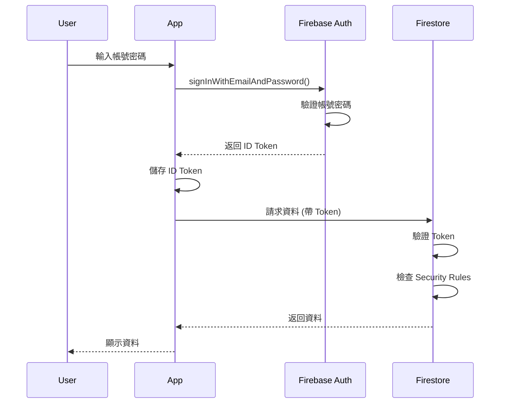

# 安全 (Security)

> 本目錄包含 GigHub 專案的安全規範、Firestore Security Rules、Firebase Auth 驗證流程與機密管理文件。

## 📋 目錄結構

```
security/
├── README.md                       # 本檔案
├── 01-security-baseline.md        # 安全基線摘要（docs-old 提取）
├── 02-security-overview.md        # 安全總覽
├── 03-authentication.md           # 認證機制
├── 04-authorization.md            # 授權機制
├── 05-security-rules.md           # Firestore Security Rules
├── 06-secret-management.md        # 機密管理
├── 07-frontend-security.md        # 前端安全限制
└── rules/                         # Security Rules 範例
    ├── firestore.rules.template
    └── storage.rules.template
```

## 🔒 安全原則

### Security First

安全性是 GigHub 的首要考量，遵循以下核心原則：

1. **深度防禦** (Defense in Depth)
   - 多層安全防護
   - 前端 + 後端雙重驗證
   - Security Rules 作為最後防線

2. **最小權限原則** (Principle of Least Privilege)
   - 預設拒絕所有存取
   - 明確授權必要權限
   - 定期審查權限配置

3. **資料隔離** (Data Isolation)
   - 多租戶完全隔離
   - Blueprint 作為權限邊界
   - 禁止跨邊界資料存取

4. **審計追蹤** (Audit Trail)
   - 記錄所有敏感操作
   - 不可篡改的日誌
   - 完整的操作歷史

## 🔐 認證機制 (Authentication)

### Firebase Authentication

GigHub 使用 Firebase Authentication 作為認證服務：

```typescript
// Login with Email/Password
import { Auth, signInWithEmailAndPassword } from '@angular/fire/auth';

@Injectable({ providedIn: 'root' })
export class AuthService {
  private auth = inject(Auth);
  
  async signIn(email: string, password: string): Promise<UserCredential> {
    try {
      return await signInWithEmailAndPassword(this.auth, email, password);
    } catch (error) {
      this.handleAuthError(error);
      throw error;
    }
  }
  
  async signOut(): Promise<void> {
    await this.auth.signOut();
    this.router.navigate(['/login']);
  }
}
```

### 認證流程



### ID Token 管理

Firebase ID Token 特性：
- **有效期**: 1 小時
- **自動刷新**: Firebase SDK 自動處理
- **包含資訊**: uid, email, email_verified

```typescript
// 取得 ID Token
const token = await this.auth.currentUser?.getIdToken();

// 強制刷新 Token
const freshToken = await this.auth.currentUser?.getIdToken(true);
```

## 🛡️ 授權機制 (Authorization)

### 多層權限檢查

```
┌──────────────────────┐
│  Firestore Rules     │ ← 最後防線 (Backend)
└──────────────────────┘
         ↑
┌──────────────────────┐
│  Route Guards        │ ← 路由守衛 (Frontend)
└──────────────────────┘
         ↑
┌──────────────────────┐
│  Permission Service  │ ← 元件權限檢查 (Frontend)
└──────────────────────┘
```

### 前端權限檢查

**Route Guard**:

```typescript
export const blueprintGuard: CanActivateFn = async (route, state) => {
  const permissionService = inject(PermissionService);
  const router = inject(Router);
  
  const blueprintId = route.params['blueprintId'];
  
  if (!await permissionService.isBlueprintMember(blueprintId)) {
    router.navigate(['/403']);
    return false;
  }
  
  return true;
};
```

**Permission Service**:

```typescript
@Injectable({ providedIn: 'root' })
export class PermissionService {
  private currentMember = signal<BlueprintMember | null>(null);
  
  hasPermission(permission: string): boolean {
    const member = this.currentMember();
    if (!member) return false;
    
    return member.permissions.includes(permission) ||
           member.role === 'owner' ||
           member.role === 'admin';
  }
  
  canEdit(): boolean {
    return this.hasPermission('task:update') || 
           this.hasPermission('task:delete');
  }
  
  canCreate(): boolean {
    return this.hasPermission('task:create');
  }
}
```

**UI 權限控制**:

```html
<!-- 使用 Permission Service -->
@if (permissionService.canCreate()) {
  <button nz-button (click)="createTask()">新增任務</button>
}

<!-- 使用 ACL 指令 (ng-alain) -->
<button nz-button *aclIf="'task:delete'" (click)="deleteTask()">刪除</button>
```

### Firestore Security Rules

**核心規則範例**:

```javascript
rules_version = '2';
service cloud.firestore {
  match /databases/{database}/documents {
    
    // ========================================
    // 輔助函數
    // ========================================
    
    function isAuthenticated() {
      return request.auth != null;
    }
    
    function getCurrentUserId() {
      return request.auth.uid;
    }
    
    function isBlueprintMember(blueprintId) {
      let memberId = getCurrentUserId() + '_' + blueprintId;
      return exists(/databases/$(database)/documents/blueprintMembers/$(memberId));
    }
    
    function hasPermission(blueprintId, permission) {
      let memberId = getCurrentUserId() + '_' + blueprintId;
      let member = get(/databases/$(database)/documents/blueprintMembers/$(memberId));
      return permission in member.data.permissions;
    }
    
    function isBlueprintOwnerOrAdmin(blueprintId) {
      let memberId = getCurrentUserId() + '_' + blueprintId;
      let member = get(/databases/$(database)/documents/blueprintMembers/$(memberId));
      return member.data.role in ['owner', 'admin'];
    }
    
    // ========================================
    // Users Collection
    // ========================================
    
    match /users/{userId} {
      allow read: if isAuthenticated() && getCurrentUserId() == userId;
      allow update: if isAuthenticated() && getCurrentUserId() == userId;
    }
    
    // ========================================
    // Blueprints Collection
    // ========================================
    
    match /blueprints/{blueprintId} {
      allow read: if isAuthenticated() && isBlueprintMember(blueprintId);
      allow update: if isAuthenticated() && isBlueprintOwnerOrAdmin(blueprintId);
      allow create: if isAuthenticated();
      allow delete: if isAuthenticated() && isBlueprintOwnerOrAdmin(blueprintId);
    }
    
    // ========================================
    // Blueprint Members Collection
    // ========================================
    
    match /blueprintMembers/{memberId} {
      allow read: if isAuthenticated() && 
                     isBlueprintMember(resource.data.blueprintId);
      
      allow create, update: if isAuthenticated() && 
                               isBlueprintOwnerOrAdmin(request.resource.data.blueprintId);
      
      allow delete: if isAuthenticated() && 
                       isBlueprintOwnerOrAdmin(resource.data.blueprintId);
    }
    
    // ========================================
    // Tasks Collection
    // ========================================
    
    match /tasks/{taskId} {
      // 讀取：Blueprint 成員可讀取
      allow read: if isAuthenticated() && 
                     isBlueprintMember(resource.data.blueprint_id);
      
      // 建立：有 task:create 權限
      allow create: if isAuthenticated() && 
                       isBlueprintMember(request.resource.data.blueprint_id) &&
                       hasPermission(request.resource.data.blueprint_id, 'task:create');
      
      // 更新：有 task:update 權限或為指派人
      allow update: if isAuthenticated() && 
                       isBlueprintMember(resource.data.blueprint_id) &&
                       (hasPermission(resource.data.blueprint_id, 'task:update') ||
                        resource.data.assigned_to == getCurrentUserId());
      
      // 刪除：有 task:delete 權限
      allow delete: if isAuthenticated() && 
                       isBlueprintMember(resource.data.blueprint_id) &&
                       hasPermission(resource.data.blueprint_id, 'task:delete');
    }
    
    // ========================================
    // Audit Logs Collection (只寫不讀)
    // ========================================
    
    match /auditLogs/{logId} {
      allow read: if false;  // 只有後端可讀取
      allow create: if isAuthenticated();
      allow update, delete: if false;  // 不可修改或刪除
    }
  }
}
```

### Security Rules 測試

```javascript
// firestore.rules.test.js
const firebase = require('@firebase/rules-unit-testing');

describe('Firestore Security Rules', () => {
  it('should allow authenticated user to read their own data', async () => {
    const db = firebase.initializeTestEnvironment({
      projectId: 'test-project',
      rules: fs.readFileSync('firestore.rules', 'utf8')
    });
    
    const authenticatedDb = db.authenticatedContext('user-1');
    
    await firebase.assertSucceeds(
      authenticatedDb.collection('users').doc('user-1').get()
    );
    
    await firebase.assertFails(
      authenticatedDb.collection('users').doc('user-2').get()
    );
  });
});
```

## 🔑 機密管理

### 環境變數

**前端配置** (`.env.local`):
```bash
# Firebase Configuration
FIREBASE_API_KEY=your-api-key
FIREBASE_AUTH_DOMAIN=your-project.firebaseapp.com
FIREBASE_PROJECT_ID=your-project-id

# 注意：這些是公開的，不是機密
```

**Cloud Functions 配置**:
```bash
# 設定機密環境變數
firebase functions:config:set api.key="YOUR_SECRET_KEY"

# 在 Functions 中使用
const apiKey = functions.config().api.key;
```

### Secret Manager (推薦)

```typescript
// 使用 Google Secret Manager
import { SecretManagerServiceClient } from '@google-cloud/secret-manager';

const client = new SecretManagerServiceClient();

async function getSecret(secretName: string): Promise<string> {
  const [version] = await client.accessSecretVersion({
    name: `projects/PROJECT_ID/secrets/${secretName}/versions/latest`,
  });
  
  return version.payload?.data?.toString() || '';
}
```

### 機密輪換策略

1. **定期輪換**: 每 90 天輪換一次
2. **緊急輪換**: 懷疑洩露時立即輪換
3. **版本管理**: 保留舊版本 30 天
4. **通知機制**: 輪換前通知相關人員

## 🚫 前端安全限制

### 1. 輸入驗證

**永遠不信任客戶端輸入**:

```typescript
// ❌ 錯誤：直接使用使用者輸入
await this.taskRepository.create({
  title: userInput  // 危險！
});

// ✅ 正確：驗證與清理
if (!userInput || userInput.length > 200) {
  throw new ValidationError('標題長度必須在 1-200 字元');
}

const sanitized = this.sanitizeInput(userInput);
await this.taskRepository.create({
  title: sanitized
});
```

### 2. XSS 防護

Angular 內建 XSS 防護：

```html
<!-- ✅ 安全：Angular 自動清理 -->
<div>{{ userInput }}</div>

<!-- ⚠️ 危險：繞過清理 -->
<div [innerHTML]="userInput"></div>

<!-- ✅ 正確：使用 DomSanitizer -->
<div [innerHTML]="sanitizedHtml"></div>
```

```typescript
import { DomSanitizer } from '@angular/platform-browser';

constructor(private sanitizer: DomSanitizer) {}

get sanitizedHtml() {
  return this.sanitizer.sanitize(
    SecurityContext.HTML, 
    this.userInput
  );
}
```

### 3. CSRF 防護

Angular HttpClient 內建 CSRF 防護：

```typescript
// HttpClient 自動處理 XSRF Token
this.http.post('/api/tasks', taskData).subscribe();
```

### 4. CSP (Content Security Policy)

```html
<!-- index.html -->
<meta http-equiv="Content-Security-Policy" 
      content="
        default-src 'self';
        script-src 'self' 'unsafe-inline' https://apis.google.com;
        style-src 'self' 'unsafe-inline';
        img-src 'self' data: https:;
        font-src 'self' data:;
        connect-src 'self' https://*.firebaseio.com https://*.googleapis.com;
      ">
```

## 📊 安全審計

### 定期審計項目

**每月**:
- [ ] 審查 Security Rules
- [ ] 檢查異常存取模式
- [ ] 驗證權限配置
- [ ] 審查審計日誌

**每季**:
- [ ] 第三方安全掃描
- [ ] 滲透測試
- [ ] 程式碼安全審查
- [ ] 依賴漏洞掃描

**每年**:
- [ ] 完整安全審計
- [ ] 合規性檢查
- [ ] 災難恢復演練
- [ ] 安全培訓

### 漏洞回報

發現安全漏洞？請遵循 [SECURITY.md](../../SECURITY.md) 中的回報流程。

**不要**:
- ❌ 在公開 Issue 揭露漏洞
- ❌ 在社交媒體發布
- ❌ 嘗試攻擊生產環境

**應該**:
- ✅ Email 至 security@gighub.com
- ✅ 提供詳細資訊
- ✅ 給予合理時間修復

## 📚 相關文件

- [架構設計](../architecture(架構)/README.md) - 安全架構設計
- [資料模型](../data-model(資料模型)/README.md) - 資料隔離策略
- [API 規格](../api(API/介面規格)/README.md) - API 安全規範
- [部署指南](../deployment(部署)/README.md) - 安全部署流程

## 🔄 變更記錄

### v1.0.0 (2025-12-21)
- ✅ 建立安全規範文件
- ✅ 定義認證與授權機制
- ✅ 提供 Security Rules 範例
- ✅ 說明機密管理策略

---

**維護者**: GigHub 開發團隊  
**最後更新**: 2025-12-21  
**版本**: v1.0.0
