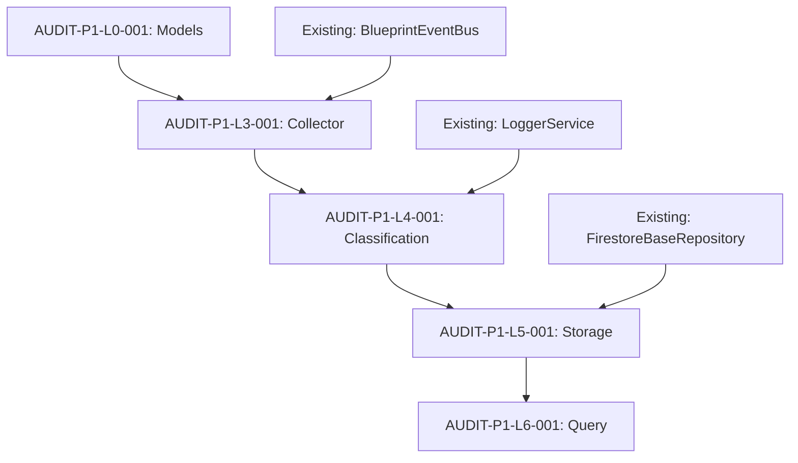

# Audit System - Detailed Task Breakdown

> **專案協調文件** (Project Coordination Document)  
> **用途**: 將架構轉化為可執行任務，避免重複功能實現  
> **更新時間**: 2025-12-26  
> **狀態**: Phase 1 Tasks Defined

---

## 📋 Task Organization Strategy

### Task Naming Convention

```
AUDIT-{PHASE}-{LAYER}-{SEQUENCE}: {Task Description}

Examples:
- AUDIT-P1-L3-001: Create AuditCollectorService with BlueprintEventBus subscription
- AUDIT-P1-L4-001: Implement ClassificationEngineService with 11-category rules
- AUDIT-P1-L5-001: Create AuditEventRepository extending FirestoreBaseRepository
```

### Task Dependencies



---

## 🎯 Phase 1: Core Infrastructure (P0)

### AUDIT-P1-L0: Models & Interfaces (Foundation)

#### AUDIT-P1-L0-001: Create Base Audit Event Interface
**Priority**: P0 🔴  
**Estimated Time**: 2 hours  
**Dependencies**: None  
**Reuses**: None (new schema definition)

**File**: `src/app/core/audit/models/audit-event.interface.ts`

**Acceptance Criteria**:
- [ ] Create base `AuditEvent` interface with all required fields
- [ ] Include blueprintId, timestamp, actor, eventType, category, severity
- [ ] Add metadata field for extensibility
- [ ] Export from models/index.ts
- [ ] No TypeScript errors in strict mode

**Integration Points**: None (foundation)

**Code Template**:
```typescript
export interface AuditEvent {
  id: string;
  blueprintId: string;
  timestamp: Date;
  actor: {
    id: string;
    type: 'user' | 'team' | 'partner' | 'ai' | 'system';
    name: string;
  };
  eventType: string; // e.g., 'user.action.login', 'ai.decision.architectural'
  category: EventCategory;
  severity: EventSeverity;
  entity?: {
    id: string;
    type: string;
    name: string;
  };
  operation?: 'CREATE' | 'READ' | 'UPDATE' | 'DELETE' | 'EXECUTE';
  changes?: {
    field: string;
    oldValue: any;
    newValue: any;
  }[];
  metadata?: Record<string, any>;
  complianceTags?: string[];
}
```

---

#### AUDIT-P1-L0-002: Create Event Category Enum
**Priority**: P0 🔴  
**Estimated Time**: 1 hour  
**Dependencies**: AUDIT-P1-L0-001  
**Reuses**: None (new enumeration)

**File**: `src/app/core/audit/models/event-category.enum.ts`

**Acceptance Criteria**:
- [ ] Define EventCategory enum with 11 categories
- [ ] Add JSDoc comments for each category
- [ ] Export from models/index.ts

**Categories** (from SCHEMA_REGISTRY.md):
1. USER_ACTION
2. AI_DECISION
3. DATA_FLOW
4. SECURITY
5. SYSTEM
6. COMPLIANCE
7. BLUEPRINT
8. TASK
9. ORGANIZATION
10. INTEGRATION
11. PERFORMANCE

---

#### AUDIT-P1-L0-003: Create Event Severity Enum
**Priority**: P0 🔴  
**Estimated Time**: 0.5 hour  
**Dependencies**: AUDIT-P1-L0-001  
**Reuses**: None (new enumeration)

**File**: `src/app/core/audit/models/event-severity.enum.ts`

**Acceptance Criteria**:
- [ ] Define EventSeverity enum: LOW, MEDIUM, HIGH, CRITICAL
- [ ] Export from models/index.ts

---

#### AUDIT-P1-L0-004: Create Storage Tier Enum
**Priority**: P0 🔴  
**Estimated Time**: 0.5 hour  
**Dependencies**: None  
**Reuses**: None (new enumeration)

**File**: `src/app/core/audit/models/storage-tier.enum.ts`

**Acceptance Criteria**:
- [ ] Define StorageTier enum: HOT, WARM, COLD
- [ ] Add retention duration comments (7d, 90d, 7y)
- [ ] Export from models/index.ts

---

### AUDIT-P1-L3: Audit Collector Service (Event Intake)

#### AUDIT-P1-L3-001: Create AuditCollectorService with EventBus Subscription
**Priority**: P0 🔴  
**Estimated Time**: 8 hours  
**Dependencies**: AUDIT-P1-L0-001, AUDIT-P1-L0-002, AUDIT-P1-L0-003  
**Reuses**: 
- ✅ `BlueprintEventBus` (src/app/core/event-bus/)
- ✅ `LoggerService` (src/app/core/services/logger/)

**Files**:
- `src/app/core/audit/collectors/audit-collector.service.ts`
- `src/app/core/audit/collectors/audit-collector.service.spec.ts`
- `src/app/core/audit/collectors/event-subscription.config.ts`

**Acceptance Criteria**:
- [ ] Create AuditCollectorService with providedIn: 'root'
- [ ] Inject BlueprintEventBus and LoggerService using inject()
- [ ] Subscribe to topics: blueprint.*, task.*, user.*, ai.*, system.*
- [ ] Implement event filtering (exclude sensitive data)
- [ ] Implement batch processing (100 events/batch, 5s timeout)
- [ ] Add circuit breaker pattern for error handling
- [ ] Write unit tests with >80% coverage
- [ ] Mock BlueprintEventBus in tests

**Integration Points**:
```typescript
import { BlueprintEventBus } from '@core/event-bus';
import { LoggerService } from '@core/services/logger';
import { inject, Injectable } from '@angular/core';

@Injectable({ providedIn: 'root' })
export class AuditCollectorService {
  private eventBus = inject(BlueprintEventBus);
  private logger = inject(LoggerService);
  private eventBatch: AuditEvent[] = [];
  
  constructor() {
    this.subscribeToEvents();
  }
  
  private subscribeToEvents(): void {
    // Reuse existing event bus - DO NOT CREATE NEW
    this.eventBus.subscribe('blueprint.*', (event) => this.captureEvent(event));
    this.eventBus.subscribe('task.*', (event) => this.captureEvent(event));
    // ... more subscriptions
  }
  
  private captureEvent(event: any): void {
    // Validation, filtering, batching logic
  }
}
```

**Existing Features to Reuse**:
1. **BlueprintEventBus** - Already handles:
   - Topic-based routing
   - Wildcard subscriptions (blueprint.*)
   - Event versioning
   - Error handling
   - Dead letter queue

2. **LoggerService** - Already provides:
   - Structured logging
   - Log levels (debug, info, warn, error)
   - Context enrichment

**DO NOT CREATE**:
- ❌ New event bus
- ❌ New logger
- ❌ New topic routing logic (use existing patterns)

---

### AUDIT-P1-L4: Classification Engine (Event Categorization)

#### AUDIT-P1-L4-001: Implement ClassificationEngineService
**Priority**: P0 🔴  
**Estimated Time**: 12 hours  
**Dependencies**: AUDIT-P1-L0-002, AUDIT-P1-L0-003, AUDIT-P1-L3-001  
**Reuses**: 
- ✅ `LoggerService` (src/app/core/services/logger/)

**Files**:
- `src/app/core/audit/classifiers/classification-engine.service.ts`
- `src/app/core/audit/classifiers/classification-rules.ts`
- `src/app/core/audit/classifiers/classification-engine.service.spec.ts`
- `src/app/core/audit/classifiers/classification-rules.spec.ts`

**Acceptance Criteria**:
- [ ] Create ClassificationEngineService with providedIn: 'root'
- [ ] Implement 11-category classification based on event type patterns
- [ ] Implement severity leveling based on operation type and entity importance
- [ ] Add entity type detection from event metadata
- [ ] Add compliance tag assignment (GDPR, HIPAA, SOC2, ISO27001)
- [ ] Implement classification rules in separate file (testable)
- [ ] Write unit tests for all 11 categories
- [ ] Write rule validation tests

**Classification Rules** (from LAYER_4_CLASSIFICATION_ENGINE.md):
```typescript
export const CLASSIFICATION_RULES: ClassificationRule[] = [
  {
    pattern: /^user\.action\./,
    category: EventCategory.USER_ACTION,
    defaultSeverity: EventSeverity.LOW,
    severityOverrides: [
      { condition: 'operation === "DELETE"', severity: EventSeverity.HIGH },
      { condition: 'entity.type === "blueprint"', severity: EventSeverity.MEDIUM }
    ]
  },
  {
    pattern: /^ai\.decision\./,
    category: EventCategory.AI_DECISION,
    defaultSeverity: EventSeverity.MEDIUM,
    complianceTags: ['AI_GOVERNANCE', 'TRANSPARENCY']
  },
  // ... 9 more rules
];
```

**Existing Features to Reuse**:
- ✅ LoggerService for classification logging

**DO NOT CREATE**:
- ❌ New pattern matching engine (use built-in RegExp)
- ❌ Hard-coded classification logic (use configurable rules)

---

#### AUDIT-P1-L4-002: Add Classification Rule Validation
**Priority**: P1 🟡  
**Estimated Time**: 4 hours  
**Dependencies**: AUDIT-P1-L4-001  
**Reuses**: None

**Acceptance Criteria**:
- [ ] Create rule validation function
- [ ] Validate all patterns are valid RegExp
- [ ] Validate all categories are defined in EventCategory enum
- [ ] Validate all severity overrides reference valid fields
- [ ] Write comprehensive tests for edge cases

---

### AUDIT-P1-L5: Storage Service (Multi-Tier Persistence)

#### AUDIT-P1-L5-001: Create AuditEventRepository
**Priority**: P0 🔴  
**Estimated Time**: 8 hours  
**Dependencies**: AUDIT-P1-L0-001, AUDIT-P1-L4-001  
**Reuses**: 
- ✅ `FirestoreBaseRepository` (src/app/core/data-access/base/)
- ✅ Firestore service from @angular/fire

**Files**:
- `src/app/core/audit/storage/audit-event.repository.ts`
- `src/app/core/audit/storage/audit-event.repository.spec.ts`

**Acceptance Criteria**:
- [ ] Extend FirestoreBaseRepository<AuditEvent>
- [ ] Set collectionName = 'audit_events'
- [ ] Implement toEntity() for Firestore → AuditEvent mapping
- [ ] Implement toDocument() for AuditEvent → Firestore mapping
- [ ] Add findByBlueprint(blueprintId, tier) method
- [ ] Add findByActor(actorId, dateRange) method
- [ ] Add findByCategory(category, dateRange) method
- [ ] Write unit tests with Firestore emulator

**Integration Points**:
```typescript
import { FirestoreBaseRepository } from '@core/data-access/base';
import { Firestore } from '@angular/fire/firestore';
import { inject, Injectable } from '@angular/core';

@Injectable({ providedIn: 'root' })
export class AuditEventRepository extends FirestoreBaseRepository<AuditEvent> {
  protected firestore = inject(Firestore);
  protected collectionName = 'audit_events';
  
  protected toEntity(data: DocumentData, id: string): AuditEvent {
    return {
      id,
      blueprintId: data['blueprint_id'],
      timestamp: this.toDate(data['timestamp']),
      actor: {
        id: data['actor_id'],
        type: data['actor_type'],
        name: data['actor_name']
      },
      // ... rest of mapping
    };
  }
  
  protected toDocument(event: Partial<AuditEvent>): DocumentData {
    return {
      blueprint_id: event.blueprintId,
      timestamp: Timestamp.fromDate(event.timestamp!),
      actor_id: event.actor?.id,
      // ... rest of mapping
    };
  }
}
```

**Existing Features to Reuse**:
1. **FirestoreBaseRepository** - Already provides:
   - executeWithRetry() with exponential backoff
   - Automatic error handling
   - Batch operations
   - Query helpers

2. **Firestore service** - Already configured in app.config.ts

**DO NOT CREATE**:
- ❌ New Firestore wrapper (FirebaseService violation)
- ❌ Custom retry logic (use inherited executeWithRetry)
- ❌ Manual error handling (use base class methods)

---

#### AUDIT-P1-L5-002: Create AuditStorageService with Tier Abstraction
**Priority**: P0 🔴  
**Estimated Time**: 4 hours  
**Dependencies**: AUDIT-P1-L5-001, AUDIT-P1-L0-004  
**Reuses**: 
- ✅ AuditEventRepository (just created)

**Files**:
- `src/app/core/audit/storage/audit-storage.service.ts`
- `src/app/core/audit/storage/audit-storage.service.spec.ts`

**Acceptance Criteria**:
- [ ] Create AuditStorageService with providedIn: 'root'
- [ ] Inject AuditEventRepository
- [ ] Implement store(event, tier: HOT|WARM|COLD) method
- [ ] Add tier-specific collection routing (hot_events, warm_events, cold_events)
- [ ] Implement query method with tier awareness
- [ ] Write unit tests

**Tier Strategy**:
- **HOT** (7 days): `audit_events_hot` collection with composite indexes
- **WARM** (90 days): `audit_events_warm` collection with reduced indexes
- **COLD** (7 years): Cloud Storage + BigQuery (Phase 2)

---

#### AUDIT-P1-L5-003: Implement Lifecycle Policy Service
**Priority**: P1 🟡  
**Estimated Time**: 8 hours  
**Dependencies**: AUDIT-P1-L5-002  
**Reuses**: 
- ✅ AuditEventRepository
- ✅ AuditStorageService

**Files**:
- `src/app/core/audit/storage/lifecycle-policy.service.ts`
- `src/app/core/audit/storage/lifecycle-policy.service.spec.ts`

**Acceptance Criteria**:
- [ ] Create LifecyclePolicyService with providedIn: 'root'
- [ ] Implement migrateHotToWarm() Cloud Function
- [ ] Implement migrateWarmToCold() Cloud Function
- [ ] Add scheduled cron jobs (daily at 2am UTC)
- [ ] Add migration monitoring and logging
- [ ] Write unit tests

**Implementation Note**: This is a **Cloud Function**, not frontend code.

---

#### AUDIT-P1-L5-004: Add Firestore Security Rules for Audit Collections
**Priority**: P0 🔴  
**Estimated Time**: 2 hours  
**Dependencies**: AUDIT-P1-L5-001  
**Reuses**: 
- ✅ Existing Security Rules patterns (firestore.rules)

**File**: `firestore.rules` (update)

**Acceptance Criteria**:
- [ ] Add read rules for audit_events_hot (BlueprintMember with audit:read permission)
- [ ] Add create rules (only service account)
- [ ] Deny update and delete (immutable audit trail)
- [ ] Add rules for audit_events_warm
- [ ] Test rules with Firebase emulator

**Security Rules Template**:
```javascript
match /audit_events_hot/{eventId} {
  allow read: if isAuthenticated() 
              && isBlueprintMember(resource.data.blueprint_id)
              && hasPermission(resource.data.blueprint_id, 'audit:read');
  
  allow create: if request.auth.token.role == 'service';
  
  // Audit events are immutable
  allow update, delete: if false;
}
```

---

### AUDIT-P1-L6: Query Service (Data Access Patterns)

#### AUDIT-P1-L6-001: Create AuditQueryService with Timeline Pattern
**Priority**: P0 🔴  
**Estimated Time**: 8 hours  
**Dependencies**: AUDIT-P1-L5-001, AUDIT-P1-L5-002  
**Reuses**: 
- ✅ AuditEventRepository
- ✅ AuditStorageService

**Files**:
- `src/app/core/audit/query/audit-query.service.ts`
- `src/app/core/audit/query/query-builder.ts`
- `src/app/core/audit/query/query-patterns/timeline-query.ts`
- `src/app/core/audit/query/audit-query.service.spec.ts`

**Acceptance Criteria**:
- [ ] Create AuditQueryService with providedIn: 'root'
- [ ] Implement queryTimeline(request: TimelineQueryRequest)
- [ ] Support date range filtering
- [ ] Support multi-dimensional filtering (category, severity, actor)
- [ ] Implement pagination with cursor support
- [ ] Add query result caching (5-minute TTL)
- [ ] Write unit tests

**Timeline Query Interface**:
```typescript
export interface TimelineQueryRequest {
  blueprintId: string;
  startDate: Date;
  endDate: Date;
  categories?: EventCategory[];
  severities?: EventSeverity[];
  actors?: string[];
  entities?: string[];
  limit?: number;
  cursor?: string;
}

export interface TimelineQueryResponse {
  events: AuditEvent[];
  nextCursor?: string;
  totalCount: number;
}
```

---

#### AUDIT-P1-L6-002: Implement Actor-Based Query Pattern
**Priority**: P0 🔴  
**Estimated Time**: 4 hours  
**Dependencies**: AUDIT-P1-L6-001  
**Reuses**: 
- ✅ AuditQueryService infrastructure

**File**: `src/app/core/audit/query/query-patterns/actor-query.ts`

**Acceptance Criteria**:
- [ ] Implement queryByActor(actorId, dateRange, options)
- [ ] Support actor type filtering (user, team, ai, system)
- [ ] Support operation filtering (CREATE, UPDATE, DELETE)
- [ ] Write unit tests

---

#### AUDIT-P1-L6-003: Implement Entity-Based Query Pattern
**Priority**: P0 🔴  
**Estimated Time**: 4 hours  
**Dependencies**: AUDIT-P1-L6-001  
**Reuses**: 
- ✅ AuditQueryService infrastructure

**File**: `src/app/core/audit/query/query-patterns/entity-query.ts`

**Acceptance Criteria**:
- [ ] Implement queryByEntity(entityId, entityType, dateRange)
- [ ] Support change tracking across operations
- [ ] Support related entity queries (e.g., all tasks in a blueprint)
- [ ] Write unit tests

---

#### AUDIT-P1-L6-004: Implement Compliance Query Pattern
**Priority**: P1 🟡  
**Estimated Time**: 4 hours  
**Dependencies**: AUDIT-P1-L6-001  
**Reuses**: 
- ✅ AuditQueryService infrastructure

**File**: `src/app/core/audit/query/query-patterns/compliance-query.ts`

**Acceptance Criteria**:
- [ ] Implement queryCompliance(complianceTag, dateRange)
- [ ] Support GDPR-specific queries (data access, consent changes)
- [ ] Support HIPAA-specific queries (PHI access)
- [ ] Support SOC2-specific queries (access control changes)
- [ ] Write unit tests

---

## 📊 Task Summary by Phase

### Phase 1: Core Infrastructure

| Task ID | Task Name | Priority | Time | Dependencies |
|---------|-----------|----------|------|--------------|
| AUDIT-P1-L0-001 | Base Audit Event Interface | P0 🔴 | 2h | None |
| AUDIT-P1-L0-002 | Event Category Enum | P0 🔴 | 1h | L0-001 |
| AUDIT-P1-L0-003 | Event Severity Enum | P0 🔴 | 0.5h | L0-001 |
| AUDIT-P1-L0-004 | Storage Tier Enum | P0 🔴 | 0.5h | None |
| AUDIT-P1-L3-001 | AuditCollectorService | P0 🔴 | 8h | L0-001, L0-002, L0-003 |
| AUDIT-P1-L4-001 | ClassificationEngineService | P0 🔴 | 12h | L0-002, L0-003, L3-001 |
| AUDIT-P1-L4-002 | Classification Rule Validation | P1 🟡 | 4h | L4-001 |
| AUDIT-P1-L5-001 | AuditEventRepository | P0 🔴 | 8h | L0-001, L4-001 |
| AUDIT-P1-L5-002 | AuditStorageService | P0 🔴 | 4h | L5-001, L0-004 |
| AUDIT-P1-L5-003 | Lifecycle Policy Service | P1 🟡 | 8h | L5-002 |
| AUDIT-P1-L5-004 | Firestore Security Rules | P0 🔴 | 2h | L5-001 |
| AUDIT-P1-L6-001 | AuditQueryService Timeline | P0 🔴 | 8h | L5-001, L5-002 |
| AUDIT-P1-L6-002 | Actor Query Pattern | P0 🔴 | 4h | L6-001 |
| AUDIT-P1-L6-003 | Entity Query Pattern | P0 🔴 | 4h | L6-001 |
| AUDIT-P1-L6-004 | Compliance Query Pattern | P1 🟡 | 4h | L6-001 |

**Total P0 Tasks**: 11 tasks, 51.5 hours  
**Total P1 Tasks**: 4 tasks, 16 hours  
**Phase 1 Total**: 67.5 hours (~2 weeks with 2 developers)

---

## 🔄 Integration Verification Checklist

After completing each task, verify integration with existing features:

### After AUDIT-P1-L3-001 (AuditCollectorService)
- [ ] Verify BlueprintEventBus subscription works
- [ ] Check that existing domain events are captured
- [ ] Confirm no duplicate event handlers created
- [ ] Test event filtering logic

### After AUDIT-P1-L4-001 (ClassificationEngineService)
- [ ] Verify 11 categories are correctly assigned
- [ ] Check severity leveling for all event types
- [ ] Confirm compliance tags are added where appropriate
- [ ] Test edge cases (unknown event types)

### After AUDIT-P1-L5-001 (AuditEventRepository)
- [ ] Verify FirestoreBaseRepository inheritance works
- [ ] Check executeWithRetry() is used for all operations
- [ ] Confirm Firestore mapping (toEntity/toDocument) is correct
- [ ] Test repository CRUD operations

### After AUDIT-P1-L5-004 (Security Rules)
- [ ] Test read access with BlueprintMember
- [ ] Test read access without permission (should fail)
- [ ] Test create with service account (should succeed)
- [ ] Test create with user account (should fail)
- [ ] Test update/delete (should always fail)

### After AUDIT-P1-L6-001 (AuditQueryService)
- [ ] Verify timeline query returns correct results
- [ ] Test pagination with cursor
- [ ] Check query caching works
- [ ] Confirm multi-dimensional filtering

---

## 📚 Related Documentation

### Implementation References
- [AUDIT_SYSTEM_IMPLEMENTATION_ROADMAP.md](./AUDIT_SYSTEM_IMPLEMENTATION_ROADMAP.md) - High-level roadmap
- [SCHEMA_REGISTRY.md](./audit-schemas/SCHEMA_REGISTRY.md) - Event schema definitions
- [LAYER_3_AUDIT_COLLECTOR.md](./audit-layers/layer-3-audit-collector.md) - Collector architecture
- [LAYER_4_CLASSIFICATION_ENGINE.md](./audit-layers/LAYER_4_CLASSIFICATION_ENGINE.md) - Classification rules
- [LAYER_5_STORAGE_TIERS.md](./audit-layers/layer-5-storage-tiers.md) - Storage architecture
- [LAYER_6_QUERY_SERVICE.md](./audit-layers/LAYER_6_QUERY_SERVICE.md) - Query patterns

### Existing Code References (DO NOT RECREATE)
- `src/app/core/event-bus/` - Reuse for event distribution
- `src/app/core/services/logger/` - Reuse for logging
- `src/app/core/data-access/base/` - Reuse FirestoreBaseRepository
- `firestore.rules` - Extend with audit rules

### Development Guidelines
- [Angular 20 Guidelines](../../.github/instructions/angular.instructions.md)
- [Repository Pattern](../../.github/instructions/ng-gighub-firestore-repository.instructions.md)
- [Signals State Management](../../.github/instructions/ng-gighub-signals-state.instructions.md)
- [Security Rules](../../.github/instructions/ng-gighub-security-rules.instructions.md)

---

## ✅ Success Criteria for Phase 1

### Functional Requirements
- [ ] All domain events are captured by AuditCollectorService
- [ ] Events are correctly categorized into 11 categories
- [ ] Events are assigned appropriate severity levels
- [ ] Events are stored in multi-tier storage (HOT/WARM)
- [ ] Timeline queries return accurate results
- [ ] Actor-based queries return all events for given actor
- [ ] Entity-based queries return change history
- [ ] Compliance queries filter by compliance tags

### Technical Requirements
- [ ] All services use inject() (not constructor injection)
- [ ] All tests have >80% coverage
- [ ] No TypeScript errors in strict mode
- [ ] No `any` types used
- [ ] Firestore Security Rules enforce access control
- [ ] All services are Injectable with providedIn: 'root'
- [ ] All public APIs have JSDoc comments

### Integration Requirements
- [ ] BlueprintEventBus integration verified
- [ ] LoggerService integration verified
- [ ] FirestoreBaseRepository inheritance verified
- [ ] No duplication of existing functionality
- [ ] Backward compatibility with existing features

---

**Status**: Ready for Development  
**Next Step**: Create feature branch and start with AUDIT-P1-L0-001  
**Estimated Completion**: 2 weeks (Phase 1 only)
