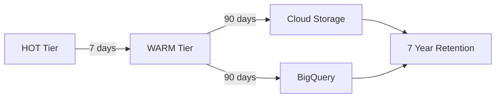

# Audit Lifecycle Management

## 📋 Overview

Automated lifecycle policy enforcement for the Global Audit Logging System's multi-tier storage architecture. Implements retention policies aligned with GitHub Master System requirements and compliance standards (GDPR, HIPAA, SOC2, ISO27001).

## 🎯 Objectives

- **Cost Optimization**: Automatically migrate data to cheaper storage tiers
- **Compliance**: Enforce retention policies for regulatory requirements
- **Performance**: Keep HOT tier lean for fast query performance
- **Archival**: Preserve audit trails for 7+ years

## 📦 Storage Tier Architecture

### HOT Tier (7 days)
- **Collection**: `audit_events_hot`
- **Purpose**: Real-time audit queries, active monitoring
- **Performance**: High read/write throughput
- **Cost**: Highest (Firestore hot storage + operations)
- **Retention**: 7 days before migration

### WARM Tier (90 days)
- **Collection**: `audit_events_warm`
- **Purpose**: Recent audit history, compliance queries
- **Performance**: Moderate read throughput
- **Cost**: Medium (Firestore storage + operations)
- **Retention**: 90 days before archival

### COLD Tier (7 years)
- **Storage**: Cloud Storage (JSON files) + BigQuery
- **Purpose**: Long-term compliance, audit forensics
- **Performance**: Low (batch analytics only)
- **Cost**: Lowest (Cloud Storage + BigQuery long-term storage)
- **Retention**: 7 years (2,555 days)

## 🔄 Migration Workflow

### Daily Automated Migration (2:00 AM UTC)



### Step-by-Step Process

#### 1. HOT → WARM Migration
```typescript
// Executed daily at 2:00 AM UTC
1. Query HOT events older than 7 days
2. Batch copy to WARM collection (500 events/batch)
3. Verify write success
4. Delete from HOT collection
5. Log migration statistics
```

**Safety Mechanisms**:
- ✅ Transactional write-verify-delete pattern
- ✅ Chunk processing (100 events) to prevent memory exhaustion
- ✅ Continue on chunk failure (partial recovery)
- ✅ Comprehensive error logging

**Expected Performance**:
- 10,000 events: ~2-3 minutes
- 50,000 events: ~8-10 minutes
- 100,000 events: ~15-20 minutes

#### 2. WARM → COLD Archival
```typescript
// Executed after HOT → WARM migration
1. Query WARM events older than 90 days
2. Group events by month
3. Archive to Cloud Storage (JSON files by month)
4. Archive to BigQuery (for analytics)
5. Delete from WARM collection
6. Log archival statistics
```

**Cloud Storage Organization**:
```
audit-archive/
├── 2025/
│   ├── 01/
│   │   ├── audit-events-2025-01-timestamp1.json
│   │   ├── audit-events-2025-01-timestamp2.json
│   │   └── ...
│   ├── 02/
│   │   └── audit-events-2025-02-timestamp1.json
│   └── ...
├── 2026/
│   └── ...
```

**BigQuery Schema**:
```sql
CREATE TABLE audit_logs.audit_events (
  event_id STRING,
  event_type STRING,
  timestamp TIMESTAMP,
  blueprint_id STRING,
  tenant_id STRING,
  actor_id STRING,
  actor_type STRING,
  category STRING,
  level STRING,
  risk_score INT64,
  compliance_tags ARRAY<STRING>,
  resource_type STRING,
  resource_id STRING,
  operation STRING,
  result STRING,
  error_code STRING,
  error_message STRING,
  migrated_at TIMESTAMP,
  migrated_from STRING,
  metadata STRING
);
```

## 🚀 Deployment

### Prerequisites

1. **BigQuery Dataset and Table**:
```bash
# Create dataset
bq mk --dataset --location=asia-east1 elite-chiller-455712-c4:audit_logs

# Create table
bq mk --table \
  --schema event_id:STRING,event_type:STRING,timestamp:TIMESTAMP,blueprint_id:STRING,tenant_id:STRING,actor_id:STRING,actor_type:STRING,category:STRING,level:STRING,risk_score:INTEGER,compliance_tags:STRING,resource_type:STRING,resource_id:STRING,operation:STRING,result:STRING,error_code:STRING,error_message:STRING,migrated_at:TIMESTAMP,migrated_from:STRING,metadata:STRING \
  elite-chiller-455712-c4:audit_logs.audit_events
```

2. **Cloud Storage Bucket**:
```bash
# Create bucket
gsutil mb -l asia-east1 gs://audit-archive

# Set lifecycle policy (delete after 7 years)
gsutil lifecycle set lifecycle.json gs://audit-archive
```

`lifecycle.json`:
```json
{
  "lifecycle": {
    "rule": [
      {
        "action": {"type": "Delete"},
        "condition": {"age": 2555}
      }
    ]
  }
}
```

3. **Firestore Indexes**:
```bash
# Ensure composite indexes exist
# Already configured in firestore.indexes.json
firebase deploy --only firestore:indexes
```

### Deploy Function

```bash
# From project root
cd src/firebase/functions-scheduler

# Install dependencies
npm install

# Build
npm run build

# Deploy to Firebase
firebase deploy --only functions:functions-scheduler:migrateAuditTiers
```

### Verify Deployment

```bash
# Check function logs
firebase functions:log --only functions-scheduler:migrateAuditTiers

# Check Cloud Scheduler job
gcloud scheduler jobs list --location=asia-east1 | grep migrateAuditTiers

# Trigger manual execution (for testing)
gcloud scheduler jobs run migrateAuditTiers --location=asia-east1
```

## 📊 Monitoring & Observability

### Cloud Logging Queries

```sql
-- View migration executions
resource.type="cloud_function"
resource.labels.function_name="migrateAuditTiers"
jsonPayload.message:"Starting audit tier migration"

-- View migration statistics
resource.type="cloud_function"
resource.labels.function_name="migrateAuditTiers"
jsonPayload.message:"Audit tier migration completed"

-- View errors
resource.type="cloud_function"
resource.labels.function_name="migrateAuditTiers"
severity>=ERROR
```

### Key Metrics to Monitor

| Metric | Target | Alert Threshold |
|--------|--------|-----------------|
| Execution Duration | < 10 min | > 15 min |
| HOT → WARM Migrated | 10k-50k/day | 0 events (stalled) |
| WARM → COLD Archived | 1k-10k/day | 0 events (stalled) |
| Error Rate | < 1% | > 5% |
| BigQuery Insert Success | > 99% | < 95% |

### Alerting Rules

```yaml
# Example alerting policy (Cloud Monitoring)
displayName: "Audit Migration Failed"
conditions:
  - displayName: "Migration Error Rate > 5%"
    conditionThreshold:
      filter: 'resource.type="cloud_function" AND resource.labels.function_name="migrateAuditTiers" AND severity>=ERROR'
      comparison: COMPARISON_GT
      thresholdValue: 5
      duration: 300s
```

## 🧪 Testing

### Unit Tests

```bash
cd src/firebase/functions-scheduler
npm test -- audit-tier-migration.test.ts
```

### Integration Tests

```bash
# Use Firebase Emulator Suite
firebase emulators:start --only functions,firestore

# In another terminal
npm run test:integration
```

### Manual Testing

```typescript
// Create test events in HOT tier
const db = admin.firestore();
const testEvents = generateTestEvents(100, 10); // 100 events, 10 days old

for (const event of testEvents) {
  await db.collection('audit_events_hot').add(event);
}

// Trigger migration manually
gcloud scheduler jobs run migrateAuditTiers --location=asia-east1

// Verify migration
const hotCount = await db.collection('audit_events_hot')
  .where('timestamp', '<', tenDaysAgo)
  .count()
  .get();

const warmCount = await db.collection('audit_events_warm')
  .where('migratedFrom', '==', 'hot')
  .count()
  .get();

console.log('HOT remaining:', hotCount.data().count); // Should be 0
console.log('WARM migrated:', warmCount.data().count); // Should be 100
```

## 🔧 Troubleshooting

### Common Issues

#### 1. Migration Not Running

**Symptoms**: No logs in Cloud Functions, data accumulating in HOT tier

**Diagnosis**:
```bash
# Check scheduler job status
gcloud scheduler jobs describe migrateAuditTiers --location=asia-east1

# Check function deployment
firebase functions:list | grep migrateAuditTiers
```

**Solutions**:
- Verify Cloud Scheduler is enabled: `gcloud services enable cloudscheduler.googleapis.com`
- Check function deployment status
- Verify IAM permissions: Cloud Scheduler needs `cloudfunctions.functions.invoke`

#### 2. BigQuery Insert Failures

**Symptoms**: `BigQuery insert failed` errors in logs

**Diagnosis**:
```bash
# Check BigQuery dataset and table exist
bq ls elite-chiller-455712-c4:audit_logs

# Check IAM permissions
gcloud projects get-iam-policy elite-chiller-455712-c4 \
  --flatten="bindings[].members" \
  --filter="bindings.members:functions-scheduler*"
```

**Solutions**:
- Ensure BigQuery dataset and table exist
- Grant `bigquery.dataEditor` role to Cloud Functions service account
- Verify schema matches expected fields

#### 3. Memory Exhaustion

**Symptoms**: `Function execution took 540001 ms, finished with status: 'timeout'`

**Diagnosis**:
- Check memory usage in Cloud Functions metrics
- Review batch size and chunk size configurations

**Solutions**:
- Reduce `BATCH_SIZE` from 500 to 250
- Reduce `MIGRATION_CHUNK_SIZE` from 100 to 50
- Increase function memory to `1024MiB`

#### 4. Cloud Storage Permission Errors

**Symptoms**: `Cloud Storage write failed` errors

**Diagnosis**:
```bash
# Check bucket permissions
gsutil iam get gs://audit-archive
```

**Solutions**:
- Grant `storage.objectCreator` role to Cloud Functions service account
- Verify bucket exists and is in correct region

## 📈 Performance Optimization

### Current Configuration (Baseline)

```typescript
BATCH_SIZE = 500             // Firestore batch limit
MIGRATION_CHUNK_SIZE = 100   // Processing chunk size
memory = '512MiB'            // Function memory
timeoutSeconds = 540         // 9 minutes
```

### High-Volume Optimization (>100k events/day)

```typescript
// Option 1: Increase parallelism
BATCH_SIZE = 500
MIGRATION_CHUNK_SIZE = 200   // Process larger chunks
memory = '1024MiB'           // More memory
maxInstances = 2             // Allow 2 concurrent executions

// Option 2: Multiple smaller runs
schedule = '0 */6 * * *'     // Run every 6 hours
BATCH_SIZE = 500
MIGRATION_CHUNK_SIZE = 100
```

### Low-Volume Optimization (<10k events/day)

```typescript
BATCH_SIZE = 250             // Smaller batches
MIGRATION_CHUNK_SIZE = 50    // Smaller chunks
memory = '256MiB'            // Less memory
schedule = '0 3 * * *'       // Once daily at 3am
```

## 💰 Cost Estimation

### Firestore Operations Cost

| Tier | Daily Events | Reads | Writes | Deletes | Monthly Cost |
|------|--------------|-------|--------|---------|--------------|
| LOW | 10,000 | 10k | 10k | 10k | ~$0.60 |
| MEDIUM | 50,000 | 50k | 50k | 50k | ~$3.00 |
| HIGH | 100,000 | 100k | 100k | 100k | ~$6.00 |

### Cloud Storage Cost

| Tier | Monthly Data | Storage Cost | Operations | Monthly Total |
|------|--------------|--------------|------------|---------------|
| LOW | 1 GB | $0.02 | $0.01 | $0.03 |
| MEDIUM | 10 GB | $0.20 | $0.05 | $0.25 |
| HIGH | 50 GB | $1.00 | $0.10 | $1.10 |

### BigQuery Cost

| Tier | Monthly Inserts | Storage (Long-term) | Query (est.) | Monthly Total |
|------|----------------|---------------------|--------------|---------------|
| LOW | 300k rows | $0.01 | $0.50 | $0.51 |
| MEDIUM | 1.5M rows | $0.05 | $2.00 | $2.05 |
| HIGH | 3M rows | $0.10 | $5.00 | $5.10 |

**Total Monthly Cost Estimate**:
- LOW: ~$1.14/month
- MEDIUM: ~$5.30/month
- HIGH: ~$12.20/month

## 📚 References

- [Cloud Scheduler Documentation](https://cloud.google.com/scheduler/docs)
- [Firestore Data Lifecycle](https://firebase.google.com/docs/firestore/ttl)
- [BigQuery Long-term Storage](https://cloud.google.com/bigquery/docs/storage_overview#long-term-storage)
- [Cloud Storage Lifecycle Management](https://cloud.google.com/storage/docs/lifecycle)

## 🔄 Version History

| Version | Date | Changes |
|---------|------|---------|
| 1.0.0 | 2025-12-26 | Initial implementation - HOT/WARM/COLD tier migration |

## 👥 Maintainers

GigHub Development Team

## 📄 License

MIT License
